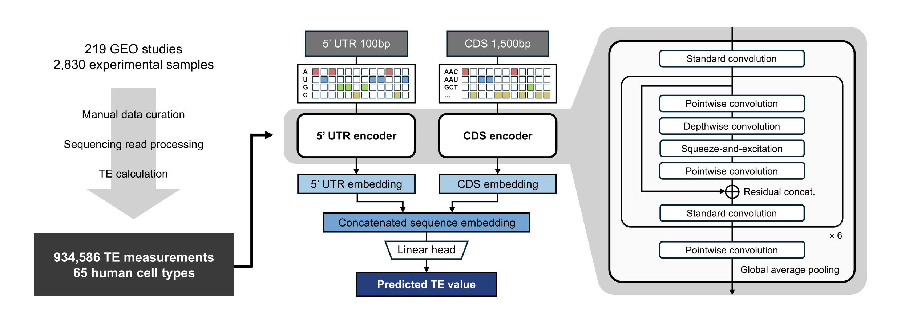

# DuET: A Unified Deep Learning Framework for Predicting mRNA Translation Efficiency Across Human Cell Types



## Installation
1. Clone this repository to your working directory.
```bash
$ git clone https://github.com/mogam-ai/DuET.git
$ cd DuET
```
2. Create a virtual environment using `environment.yml` and activate it.
```bash
$ conda env create -f environment.yml -n duet
$ conda activate duet
```

### Dependencies
Note: DuET utilizes CUDA-based GPUs for model training. The training process was conducted using an NVIDIA A100-SXM4-40GB GPU.
- `python` 3.10.13
- `pytorch` 2.2.0
- `pytorch-cuda` 12.1
- `pytorch-lightning` 2.4.0
- `numpy` 1.26.3
- `pandas` 2.1.4
- `omegaconf`
- `wandb`

## Usage

### Data Preparation
TE measurement for 65 human cell types and reference datasets used for the benchmark task are deposited at [This HuggingFace repository](https://huggingface.co/datasets/mogam-ai/DuET-dataset).

### Model training
**Training process**<br>
You can train DuET model instance using `scripts/train.py` as follows:
```bash
$ CUDA_VISIBLE_DEVICES=0 python scripts/train.py \
    --config configs/duet_base.yaml \
    --config configs/training_data/[cell type].yaml
```
Multiple configs can be supplied, and the ones presented earlier will be overriden.<br>
You can also specify `--override-configs` items in YAML syntax to override configurations at runtime.
```bash
$ CUDA_VISIBLE_DEVICES=0 python scripts/train.py \
    --config configs/duet_base.yaml \
    --config configs/training_data/all-celltype.yaml \
    --override-configs model.param.encoder='dual' optimizer.lr=1e-5 trainer.max_epochs=100
```
**Usage of WandB**<br>
We implemented [WandB](https://wandb.ai/) to effectively monitor the training processes.<br>
To proceed with WandB, please follow [this tutorial](https://wandb.ai/quickstart?utm_source=app-resource-center&utm_medium=app&utm_term=quickstart&product=models) before running the training script.<br>
You also need to modify the following configuration with your own WandB settings:
```yaml
use_wandb: [set to True to use WandB or False to not]
exp_name: [your exp name for this training process]
notes: [your note for this training process]
project_name: [your WandB project name]
```

### Prediction using trained model instance
You can predict TE of your own sequence using `scripts/predict.py` as follows:
```bash
$ python scripts/predict.py \
    --utr5 [your 5' UTR sequence] \
    --cds [your CDS sequence]
```

Use batch input mode to predict TEs of multiple sequences:
```bash
$ python scripts/predict.py \
    --input [path to input_file.tsv]
    --output [path to output_file.tsv]
```

By default, the script uses DuET model instance pretrained with the pan-cell-type averaged TE dataset.<br>
You can supply your own DuET model instance to the prediction script via model arguments:
```bash
$ python scripts/predict.py \
    --input [path to input_file.tsv]
    --output [path to output_file.tsv]
    --model_ckpt [path to custom DuET model checkpoint]
    --model_config [path to the training config of the custom model]
    --label_scaler [path to the StandardScaler instance of the custom model]
```

## License

## Citation
To be announced
