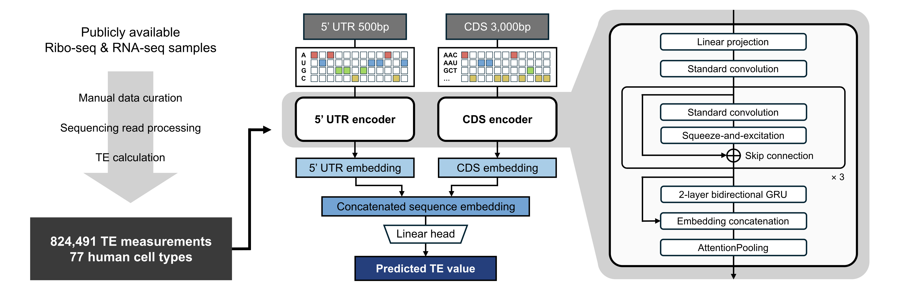

# DuET: A Unified Deep Learning Framework for Predicting mRNA Translation Efficiency Across Human Cell Types



DuET predicts translation efficiency (TE) from a transcript's 5' UTR and CDS
sequences, jointly across 76 human cell types (multi-target). A bundled
pan-cell-type checkpoint ships with the package for immediate inference.

## Installation

DuET is a pip-installable package (source under `src/duet`).

```bash
$ git clone https://github.com/mogam-ai/DuET.git
$ cd DuET
$ pip install -e .
```

Optionally create the conda environment first:
```bash
$ conda env create -f environment.yml -n duet
$ conda activate duet
$ pip install -e .
```

Install the optional `dev` extras (WandB, pyarrow) for training with experiment
tracking:
```bash
$ pip install -e ".[dev]"
```

### Datasets

The `datasets/` directory is not included in this repository. Download the
dataset archive from Zenodo, extract it, and place the resulting `datasets/`
directory at the repository root (this is where the training/benchmark configs
expect it):

```bash
# Download datasets.tar.gz from Zenodo: [ZENODO_LINK_PLACEHOLDER]
$ tar -xzf datasets.tar.gz    # extracts a datasets/ directory
$ mv datasets/ /path/to/DuET/ # place it at the repository root
```

### Dependencies
DuET uses CUDA-based GPUs for training; the models were trained on an
NVIDIA A100-SXM4-40GB. Core requirements (see `pyproject.toml` for versions):
`python>=3.10`, `torch>=2.0`, `pytorch-lightning>=2.0`, `numpy`, `pandas`,
`omegaconf`, `scikit-learn`, `scipy`, `joblib`, `loguru`, `tqdm`.

Sequence-feature generation (`scripts/generate_sequence_feature.py`) and the
downstream-analysis notebooks need extra packages (viennarna, biopython, captum,
umap-learn, xgboost, logomaker, seaborn, plotly); these are provided by
`environment.yml`, so use the conda environment for those workflows.

## Quick start (prediction)

```python
import duet

# DuET returns a DataFrame (rows = query order, cols = 76 cell types).
df = duet.predict(query=[
        {"utr5": "ATGCATGCATGCATGCATGC", "cds": "ATGAAATTTGGGCCCAAATTTGGGCCC"},
        {"utr5": "GCTAGCTAGCTAGCTAGCTA", "cds": "ATGCCCGGGTTTAAACCCGGGTTTAAA"},
    ], device="cuda:0")

# target="hek293t"          -> list[float] for one cell type
# target=["hek293t","a549"] -> DataFrame for a subset
```

## Data preparation

Download and place the `datasets/` directory as described in
[Installation > Datasets](#datasets).

## Usage

### Prediction (`scripts/predict.py`)

Predict a single sequence from the command line:
```bash
$ python scripts/predict.py \
    --utr5 [5' UTR sequence] \
    --cds  [CDS sequence]
```

By default the TE for every cell type is reported. Use `--target` to report
only specific cell type(s) (comma-separated; the `TE_` prefix is optional):
```bash
$ python scripts/predict.py \
    --utr5 [5' UTR sequence] \
    --cds  [CDS sequence] \
    --target hek293t,a549
```

Batch mode reads a `.tsv` with `utr5` and `cds` columns (`txID` optional);
see `misc/batch_dataset_example.tsv` for the expected format:
```bash
$ python scripts/predict.py \
    --input  [input.tsv] \
    --output [output.tsv]
```

Prediction uses the checkpoint bundled with the package
(`src/duet/ckpts/duet/`). Control inference with `--device`
(e.g. `cuda:0`, `cpu`) and `--batch_size`.

### Training (`scripts/train.py`)

Train a model from one or more config files (later configs override earlier ones):
```bash
$ CUDA_VISIBLE_DEVICES=0 python scripts/train.py \
    --config configs/duet.yaml
```

Available base configs:
- `configs/duet.yaml` — multitask model (76 cell-type TE outputs)
- `configs/duet_singletask.yaml` — single-task (scalar TE) model
- `configs/ablation_study/*.yaml` — ablation variants

Override any configuration at runtime with `--override-configs` (YAML syntax):
```bash
$ CUDA_VISIBLE_DEVICES=0 python scripts/train.py \
    --config configs/duet.yaml \
    --override-configs exp_name=my_run optimizer.lr=1e-5 trainer.max_epochs=100
```

The training set is defined inside each config (`dataset.train` / `dataset.test`),
so no separate data-config file is required.

Equivalent Python API:
```python
import duet
duet.train(
    config_paths=["configs/duet.yaml"],
    override_configs={"exp_name": "my_run"},
    device="cuda:0",
)
```

**WandB (optional).** Training is monitored with [WandB](https://wandb.ai/) when
`use_wandb: True`. Follow the [WandB quickstart](https://wandb.ai/quickstart)
and set your own values in the config:
```yaml
use_wandb: True
exp_name:     [experiment name]
notes:        [run notes]
project_name: [WandB project name]
```

### Parsing predictions

After k-fold training, collect per-fold out-of-fold predictions into a single
long-format table:
```bash
$ python scripts/parse_predictions.py <exp_prefix>            # single-task
$ python scripts/parse_predictions_multitask.py <exp_prefix>  # multitask
```

### Downstream analysis

`downstream_analysis/` holds the interpretation workflows used in the paper.
Most are Jupyter notebooks that load the bundled checkpoint and a dataset, and
run in the `duet` conda environment:

- `attribution_score_and_attention.ipynb` — per-position attribution and attention
- `embedding_umap.ipynb` — UMAP of learned sequence embeddings
- `xgboost_feature_importance.ipynb` — sequence-feature importance (XGBoost)
- `motif_search/` — motif discovery (XSTREME / TF-MoDISco / attention STREME)

```bash
$ conda activate duet
$ jupyter lab   # then run the notebooks under downstream_analysis/
```

The motif-search step uses external tools (MEME Suite, TF-MoDISco) in a separate
environment; see `downstream_analysis/motif_search/README.md` for its pipeline
and `environment_motif.yml`.

## Repository layout

- `src/duet/` — the installable package (models, data, configs, `api.py`, bundled `ckpts/`)
- `scripts/` — CLI entry points (train, predict, parse, feature generation)
- `configs/` — training configs (base + ablations + sequence features)
- `benchmarks/` — benchmark task framework
- `downstream_analysis/` — attribution, attention, embedding, and motif analyses
- `datasets/` — training/benchmark data (downloaded from Zenodo)

## License

[](https://opensource.org/licenses/MIT)

## Citation
To be announced.
